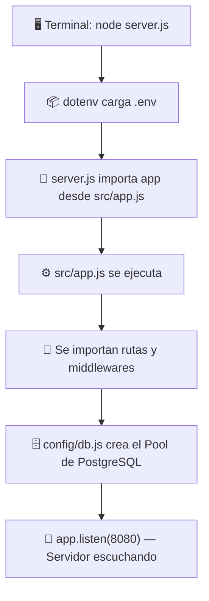
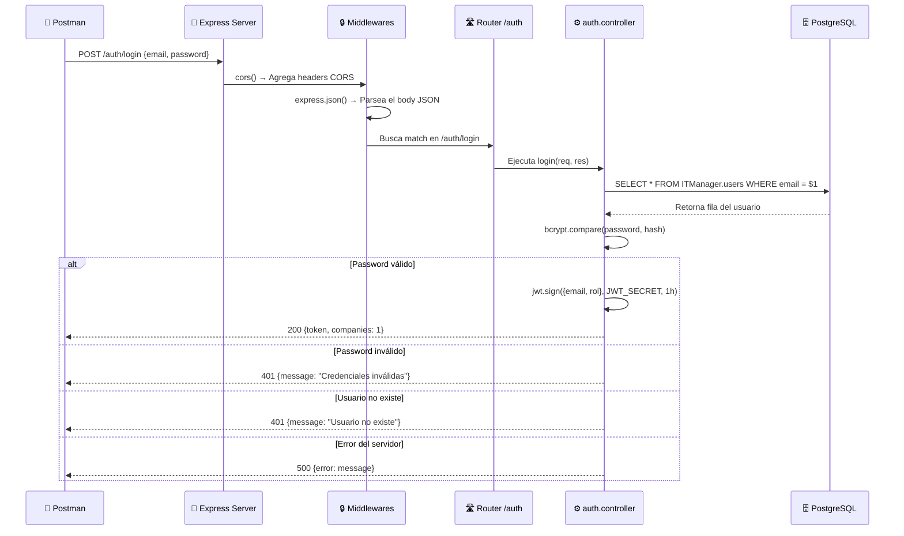

# Flujo de Ejecución — IT Manager Backend

## Visión General

El backend de IT Manager es una API REST construida con **Node.js + Express 5**, que se conecta a una base de datos **PostgreSQL en Supabase** y expone endpoints para autenticación y gestión de usuarios.

---

## 1. Punto de Entrada: `node server.js`

Cuando ejecutas `node server.js`, el sistema operativo carga Node.js y este es el orden exacto de ejecución:



### Paso a paso:

| Orden | Archivo | Qué hace |
|:-----:|---------|----------|
| 1 | [.env](file:///f:/proyectos/it-manager/backend/.env) | `dotenv` inyecta las 7 variables de entorno (`DB_HOST`, `DB_PORT`, `DB_NAME`, `DB_USER`, `DB_PASSWORD`, `JWT_SECRET`, `PORT`) |
| 2 | [server.js](file:///f:/proyectos/it-manager/backend/server.js) | Importa `app` desde [src/app.js](file:///f:/proyectos/it-manager/backend/src/app.js) y ejecuta `app.listen(8080)` |
| 3 | [src/app.js](file:///f:/proyectos/it-manager/backend/src/app.js) | Crea la instancia Express, registra middlewares y rutas |
| 4 | [config/db.js](file:///f:/proyectos/it-manager/backend/config/db.js) | Crea un `Pool` de conexiones a PostgreSQL (Supabase) con SSL |

---

## 2. Configuración de la Aplicación ([src/app.js](file:///f:/proyectos/it-manager/backend/src/app.js))

Cuando [server.js](file:///f:/proyectos/it-manager/backend/server.js) importa `app`, se ejecuta [src/app.js](file:///f:/proyectos/it-manager/backend/src/app.js) que configura todo en este orden:

```
1. express()          → Crea la instancia de la aplicación
2. app.use(cors())    → Habilita CORS (cualquier origen)
3. app.use(json())    → Parsea bodies JSON automáticamente  
4. app.get('/')       → Ruta raíz "API Funcionando..."
5. app.use('/', healthRoutes)       → Monta rutas de salud
6. app.use('/auth', authRoutes)     → Monta rutas de autenticación
7. app.use('/usuarios', userRoutes) → Monta rutas de usuarios
8. app.use(errorHandler)            → Middleware global de errores (al final)
```

---

## 3. Conexión a Base de Datos ([config/db.js](file:///f:/proyectos/it-manager/backend/config/db.js))

Se ejecuta **una sola vez** cuando cualquier archivo lo importa. Crea un pool de conexiones reutilizable:

```
Pool de PostgreSQL
├── Host:     aws-0-us-west-2.pooler.supabase.com
├── Puerto:   6543
├── Database: postgres  
├── SSL:      Habilitado (rejectUnauthorized: false)
├── Max conexiones: 10
├── Timeout conexión: 10s
└── Idle timeout: 30s
```

> [!IMPORTANT]
> El pool **NO se conecta inmediatamente al crearse**. La primera conexión real ocurre cuando se ejecuta el primer `pool.query()` (lazy connection).

---

## 4. Mapa de Rutas y Endpoints

### Rutas de Salud (Health)
| Método | Endpoint | Archivo | Función |
|--------|----------|---------|---------|
| GET | `/` | [app.js](file:///f:/proyectos/it-manager/backend/src/app.js) | Retorna "API Funcionando..." |
| GET | `/db-check` | [health.routes.js](file:///f:/proyectos/it-manager/backend/src/routes/health.routes.js) | Ejecuta `SELECT NOW()` para verificar la conexión a la DB |

### Rutas de Autenticación (`/auth`)
| Método | Endpoint | Archivo | Función |
|--------|----------|---------|---------|
| POST | `/auth/login` | [auth.controller.js](file:///f:/proyectos/it-manager/backend/src/controllers/auth.controller.js) | Valida email/password, genera JWT |

### Rutas de Usuarios (`/usuarios`)
| Método | Endpoint | Archivo | Función |
|--------|----------|---------|---------|
| GET | `/usuarios/listaUsuarios` | [user.controller.js](file:///f:/proyectos/it-manager/backend/src/controllers/user.controller.js) | Lista todos los usuarios con estado de registro |
| POST | `/usuarios/crearUsuario` | [user.controller.js](file:///f:/proyectos/it-manager/backend/src/controllers/user.controller.js) | Crea un nuevo usuario en la DB |

---

## 5. Flujo de un Request (Ejemplo: Login)



---

## 6. Estructura de Archivos del Proyecto

```
backend/
├── 📄 server.js              ← PUNTO DE ENTRADA (node server.js)
├── 📄 package.json            ← Dependencias y scripts
├── 📄 .env                    ← Variables de entorno (secretos)
│
├── config/
│   └── 📄 db.js               ← Pool de conexiones PostgreSQL
│
└── src/
    ├── 📄 app.js              ← Configuración Express (middlewares + rutas)
    ├── 📄 index.js            ← ⚠️ Archivo legacy (NO se usa actualmente)
    │
    ├── controllers/
    │   ├── 📄 auth.controller.js   ← Lógica de login (bcrypt + JWT)
    │   └── 📄 user.controller.js   ← Lógica CRUD de usuarios
    │
    ├── middlewares/
    │   └── 📄 error.middleware.js  ← Captura errores no manejados
    │
    ├── models/
    │   └── 📄 schema.sql          ← Esquema de la base de datos
    │
    └── routes/
        ├── 📄 auth.routes.js      ← POST /auth/login
        ├── 📄 health.routes.js    ← GET /db-check
        └── 📄 user.routes.js      ← GET/POST /usuarios/*
```

---

## 7. Dependencias del Proyecto

| Paquete | Versión | Para qué se usa |
|---------|---------|-----------------|
| `express` | 5.2.1 | Framework web (manejo de rutas y HTTP) |
| `pg` | 8.20.0 | Driver PostgreSQL (conexión a Supabase) |
| `dotenv` | 17.3.1 | Carga variables de entorno desde [.env](file:///f:/proyectos/it-manager/backend/.env) |
| `bcrypt` | 6.0.0 | Hash y comparación de contraseñas |
| `jsonwebtoken` | 9.0.3 | Generación y verificación de tokens JWT |
| `cors` | 2.8.6 | Permite requests cross-origin |

---

## 8. Cadena de Errores

Cuando algo falla, los errores fluyen así:

```
Controller lanza error
    ↓
next(error) lo pasa al siguiente middleware
    ↓
errorHandler (último middleware en app.js)
    ↓
Responde: { ok: false, mensaje: "Error interno del servidor" }
```

> [!NOTE]
> El [src/index.js](file:///f:/proyectos/it-manager/backend/src/index.js) es un archivo **legacy** de una versión anterior del proyecto. El punto de entrada actual es [server.js](file:///f:/proyectos/it-manager/backend/server.js) → [src/app.js](file:///f:/proyectos/it-manager/backend/src/app.js). Este archivo no se usa en la ejecución actual.
